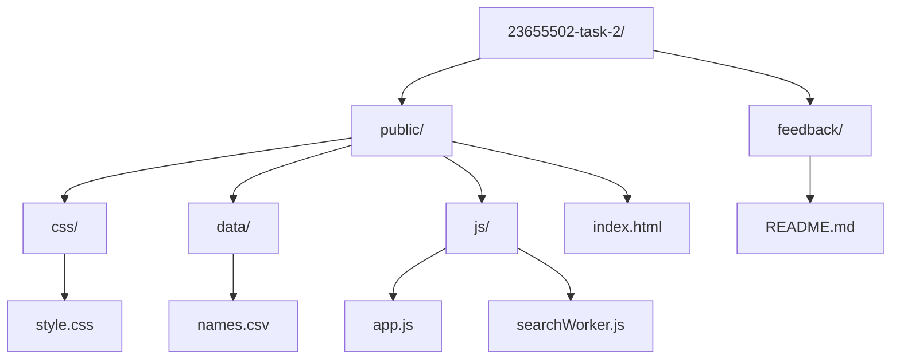
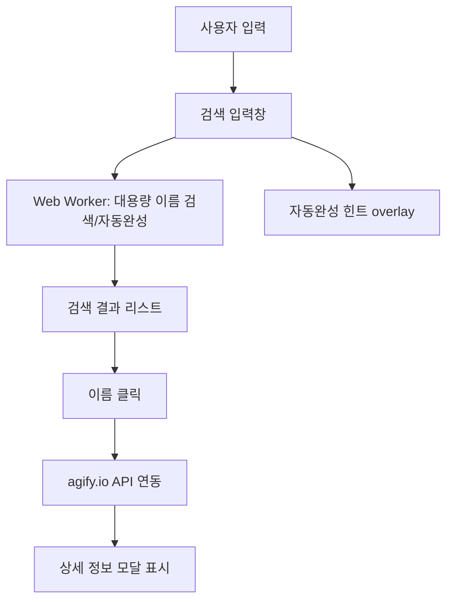

# 이름 검색 시스템 - 개선 설명서

## 1. 지원자 정보
- 이름: 김도영
- 연락처: 010-2365-5502
- 이메일: coby5502@gmail.com

---

## 2. 파일/디렉토리 구조

```
23655502-task-2/
├── feedback/
│   └── README.md
├── public/
│   ├── css/
│   │   └── style.css
│   ├── data/
│   │   └── names.csv
│   ├── js/
│   │   ├── app.js
│   │   └── searchWorker.js
│   └── index.html
```

---

## 3. 프로젝트 실행 방법

1. 이 저장소를 클론하거나 압축을 해제합니다.
2. **(권장) Python 서버로 실행:**
   - 터미널에서 프로젝트 루트(23655502-task-2)로 이동 후 아래 명령어 실행
     - Python 3: `python3 -m http.server 8080`
     - Python 2: `python -m SimpleHTTPServer 8080`
   - 브라우저에서 `http://localhost:8080/public/index.html` 접속
3. **(간단 실행) public/index.html 파일을 브라우저에서 직접 열어도 동작**
   - 단, 일부 브라우저/환경에서는 fetch 등 파일 접근 제한이 있을 수 있으므로 Python 서버 실행을 권장합니다.

---

## 4. 결과물 설명
### 4-1. 주요 기능
- **이름 자동완성 및 대용량 검색**: 10만개 이상의 이름 데이터도 빠르게 검색/자동완성 가능
- **API 연동**: 검색 결과의 이름을 클릭하면 agify.io API로 상세 정보(예상 나이 등) 모달 표시
- **외부 데이터 분리**: 이름 데이터는 별도 CSV 파일로 관리
- **Web Worker 도입**: 대용량 데이터도 UI 멈춤 없이 검색/자동완성 처리
- **반응형 UI/UX**: 모바일, 태블릿, 데스크탑 모두 자연스럽고 일관된 디자인
- **페이지네이션**: 검색 결과를 10개씩, 화면 크기에 따라 유동적으로 표시, 구글/네이버 스타일의 페이지네이션 구현

### 4-2. UI/UX 및 디자인 개선
- 카드형 중앙 고정 레이아웃에서 상단 고정 헤더+넓은 검색바+리스트 구조로 변경
- 밝고 부드러운 컬러, 여백, 반응형, 모바일 UX 개선
- 모달, 리스트, 페이징 등 모든 컴포넌트의 여백/정렬/폰트/컬러 일관성 강화

### 4-3. 코드 구조 및 유지보수성 개선
- JS, CSS, 데이터 파일 분리 및 폴더 구조 정리 (public/css, public/js, public/data)
- DOM 전체 재생성 제거, 불필요한 반복/중복 코드 제거, 가독성 향상
- CSS 중복/충돌 정리, 미디어쿼리로 모바일/데스크탑 모두 일관성 유지

---

## 5. 원본 소스 문제점 및 개선점

### 5-1. 원본 소스의 실제 문제점
- **구조적 비효율**:
  - 입력값이 바뀔 때마다 `.container` 전체를 remove → innerHTML로 새로 생성 → 다시 붙임
  - input을 cloneNode로 복제, 이벤트를 매번 새로 바인딩
  - 동일 쿼리 함수(nameListQuery1 등) 반복 호출
  - 코드 중복, 복잡성 증가

- **렌더링/성능 문제**:
  - 전체 DOM 재생성으로 인한 렌더링 비용 증가
  - 대용량 데이터에서 성능 저하 가능성

- **이벤트 처리 방식 비정상**:
  - input을 매번 새로 만들고 이벤트를 다시 바인딩

### 5-2. 개선점 및 반영 내역
- **구조적 효율화**
  - 화면 구조는 고정, 입력값 변화 시 필요한 부분만 업데이트
  - input, 결과 리스트, 자동완성 overlay 등은 한 번만 만들고, 내부 내용만 갱신
  - 이벤트 바인딩도 최초 1회만 수행
  - 중복 함수 호출, 코드 중복 제거

- **성능 개선**
  - DOM 전체 재생성 제거로 렌더링 비용 최소화
  - 대용량 데이터에서도 빠르고 부드러운 검색/자동완성 가능

- **코드 가독성/유지보수성 향상**
  - 함수/이벤트/스타일 중복 제거, 가독성/유지보수성 대폭 향상

---

## 6. 설계 및 구조 다이어그램



(아래는 시스템 동작 구조)



**시스템 동작 흐름:**
- **A**: 사용자가 이름을 입력
- **B**: 입력창에서 실시간 입력 감지
- **C**: Web Worker에서 대용량 이름 데이터 검색/자동완성 처리
- **D**: 검색 결과 리스트 렌더링
- **E**: 결과 이름 클릭 시
- **F**: agify.io API로 상세 정보 요청
- **G**: 모달로 상세 정보 표시
- **H**: 입력창에 자동완성 힌트(overlay) 표시